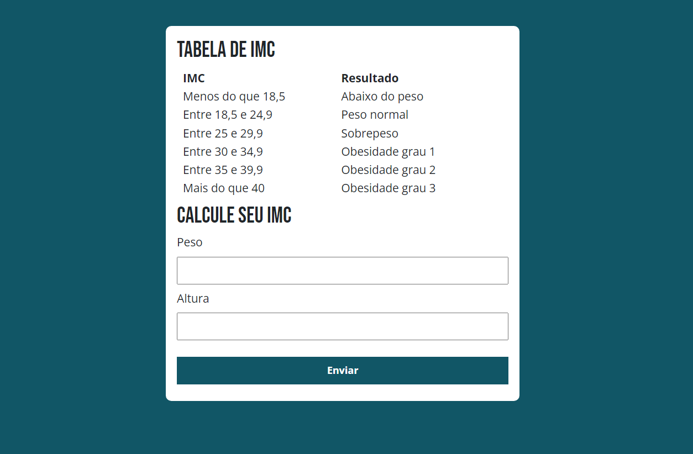

# Calculadora de IMC (Índice de Massa Corporal)
Esta é uma aplicação simples que permite calcular o Índice de Massa Corporal (IMC) de uma pessoa com base no seu peso e altura. O IMC é uma medida que relaciona o peso e a altura de uma pessoa e é amplamente utilizado para avaliar se uma pessoa está com peso adequado, abaixo do peso, com sobrepeso ou obesa.

## Como Usar
Para usar a calculadora de IMC, basta preencher o formulário com seu peso e altura e clicar no botão "Enviar". O resultado do cálculo será exibido abaixo do formulário, indicando o IMC calculado e sua classificação de acordo com a tabela de IMC fornecida.

  

 

## Tabela de IMC
A aplicação inclui uma tabela de IMC para ajudar a interpretar os resultados do cálculo. A tabela associa faixas de IMC a classificações como "Abaixo do Peso", "Peso Normal", "Sobrepeso" e diferentes graus de obesidade.

## Estrutura do Código
HTML: O arquivo HTML (index.html) contém a estrutura da página, incluindo o formulário para inserir o peso e a altura, a tabela de IMC e uma área para exibir o resultado do cálculo.
CSS: O arquivo CSS (style.css) contém estilos para tornar a página mais apresentável.
JavaScript: O arquivo JavaScript (main.js) contém o código responsável por calcular o IMC com base nos valores inseridos no formulário, exibir o resultado na página e adicionar um evento de escuta ao formulário para realizar o cálculo quando o formulário é enviado.
Funcionamento do Código
A função calcularImc() é responsável por configurar a aplicação. Ela seleciona o formulário e a área de resultado na página HTML, adiciona um ouvinte de evento para o envio do formulário e define a função receberEventoForm(evento) para tratar o evento de envio do formulário.

Na função receberEventoForm(evento), o código obtém os valores de peso e altura do formulário, calcula o IMC com base nesses valores e determina a classificação do IMC de acordo com as faixas pré-estabelecidas. O resultado é então exibido na área de resultado na página HTML.

## Tecnologias Utilizadas
HTML  
CSS  
JavaScript   
Bootstrap (para estilos adicionais)  
Google Fonts (fonte utilizada)

  
  
  
  

## Como Executar
Para executar a aplicação, basta abrir o arquivo index.html em um navegador da web compatível com HTML5. Certifique-se de que todos os arquivos JavaScript, CSS e as fontes estejam presentes e acessíveis no mesmo diretório que o arquivo HTML.

